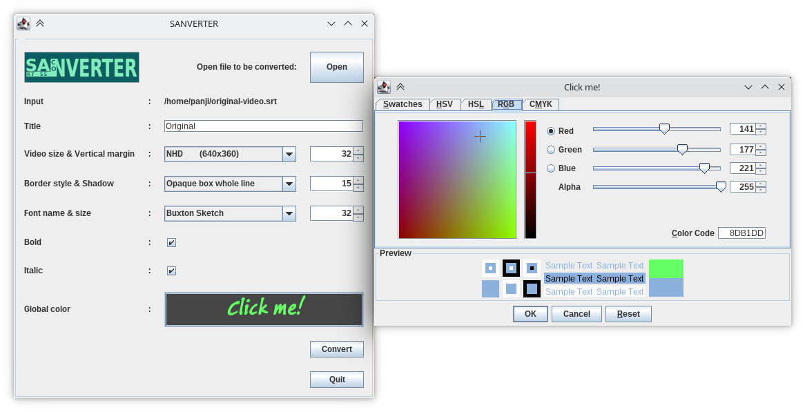

<p align="center">
    
</p>

# SANVERTER

**SRT⟷ASS Converter**

Convert SRT file to ASS file and vise versa.

Author: _Panji Kusuma (epanji@gmail.com)_

### Drawbacks

- Detail timing will change due to milliseconds and centiseconds different.
- Information such as title, style and some modifiers will loss due to conversion.
- Only **bold**, *italic*, <u>underline</u>, <s>strikeout</s> and <font color="#00FFFF">colors</font> will be preserve.
- Global styles did not preserve like local modifiers.

## Dependencies

- [esrap](https://github.com/scymtym/esrap)
- [claraoke](https://github.com/epanji/claraoke)

## Primary features

Convert file.srt to file.ass with adjustment options

```
SANVERTER> (convert-srt-to-ass #p"bad-source.srt" :output #p"tmp.ass" :title "Temporary" :primary-colour "blue violet")
#P"tmp.ass"
```
Convert file.ass to file.srt with optional output

```
SANVERTER> (convert-ass-to-srt #p"bad-source.ass" :output #p"tmp.srt")
#P"tmp.srt"
```

## Secondary features

Parsing and printing source with bad SRT format:

```
SANVERTER> (uiop:run-program "cat bad-source.srt" :output *standard-output*)
1
00:00:00,000 --> 00:01:20,000
Hello world!

00:01:20,000 --> 00:02:40,000
<font color=#1A2B3C>Hello <b>world</b>!</font>

3
00:02:40,000 --> 00:01:20,000
<font color="#ABC">Hello <b>world!
Hello world!
NIL
NIL
0

SANVERTER> (parse-subrip #p"bad-source.srt")
#<SUBTITLE "Untitled" {100774A823}>
(#<#<0:02:40.00> --> #<0:04:00.00> "Hello world!Hello world!" (3)>
 #<#<0:01:20.00> --> #<0:02:40.00> "Hello world!" (4)>
 #<#<0:00:00.00> --> #<0:01:20.00> "Hello world!" (0)>)

SANVERTER> (print-subrip #p"bad-source.srt")
1
00:00:00,000 --> 00:01:20,000
Hello world!

2
00:01:20,000 --> 00:02:40,000
<font color="#1A2B3C">Hello <b>world</b>!</font>

3
00:02:40,000 --> 00:04:00,000
<font color="#AABBCC">Hello <b>world!
Hello world!</b></font>

NIL
```

Parsing and printing source with bad ASS format:

```
SANVERTER> (uiop:run-program "cat bad-source.ass" :output *standard-output*)
; Where is script info, style and others!
Dialogue: 0,0:00:00.00,0:01:20.00,Default,,0,0,0,,Hello world!
Dialogue: 0,0:01:20.00,0:02:40.00,Default,,0,0,0,,{\1c&H3C2B1A&}Hello {\b1}world{\b0}!
Dialogue: 0,0:02:40.00,0:04:00.00,Default,,0,0,0,,{\1c&HCCBBAA&}Hello {\b1}world!\NHello world!
NIL
NIL
0

SANVERTER> (parse-subass #p"bad-source.ass")
#<SUBTITLE "Untitled" {10071932E3}>
(#<#<0:02:40.00> --> #<0:04:00.00> "Hello world!Hello world!" (3)>
 #<#<0:01:20.00> --> #<0:02:40.00> "Hello world!" (3)>
 #<#<0:00:00.00> --> #<0:01:20.00> "Hello world!" (0)>)

SANVERTER> (print-subass #p"bad-source.ass")
[Script Info]
; Script generated by CLARAOKE v0.1.11 ( https://github.com/epanji/claraoke )
Title: Untitled
ScriptType: v4.00+
Collisions: Normal
PlayResX: 1280
PlayResY: 720
PlayDepth: 0
Timer: 100.0000
WrapStyle: 0

[V4+ Styles]
Format: Name, Fontname, Fontsize, PrimaryColour, SecondaryColour, OutlineColour, BackColour, Bold, Italic, Underline, StrikeOut, ScaleX, ScaleY, Spacing, Angle, BorderStyle, Outline, Shadow, Alignment, MarginL, MarginR, MarginV, Encoding
Style: Default,Arial,32,&H0000A5FF,&H00FFFFFF,&H00000000,&H00000000,-1,0,0,0,100,100,0,0,1,1,1,2,25,25,72,1

[Events]
Format: Layer, Start, End, Style, Name, MarginL, MarginR, MarginV, Effect, Text
Dialogue: 0,0:00:00.00,0:01:20.00,Default,,0,0,0,,Hello world!
Dialogue: 0,0:01:20.00,0:02:40.00,Default,,0,0,0,,{\1c&H3C2B1A&}Hello {\b1}world{\b0}!
Dialogue: 0,0:02:40.00,0:04:00.00,Default,,0,0,0,,{\1c&HCCBBAA&}Hello {\b1}world!\NHello world!

NIL
```

## Swing GUI

This is **SANVERTER** when running with **ABCL** (Armed Bear Common Lisp) in **JVM** (Java Virtual Machine)



## License

[BSD 2-Clause License](LICENSE)

